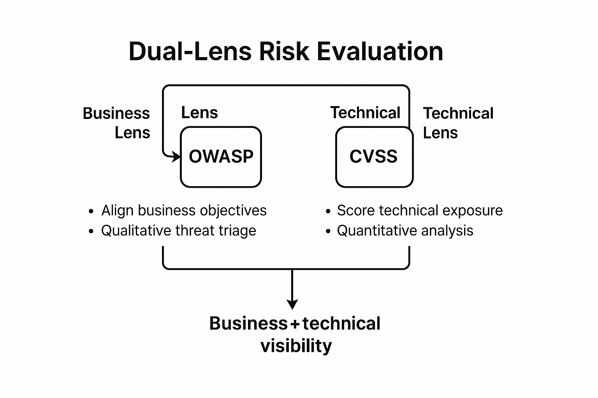

# Risk Evaluation Framework – OWASP + CVSS v3.1

This document defines the dual-lens risk evaluation framework used in threat modeling and risk management projects. It integrates **OWASP** qualitative scoring with **CVSS v3.1** quantitative metrics to bridge **business risk** and **technical severity**.

---

## 🎯 Purpose

Security architecture decisions require balancing business impact with technical exploitability.  
This framework ensures both are captured and mapped into measurable, auditable outcomes.

---

## 🧩 Framework Overview

| Lens | Standard | Focus | Outcome |
|------|-----------|--------|----------|
| **Business Lens** | OWASP Risk Rating | Likelihood × Impact (Business) | Prioritized mitigation aligned to business value |
| **Technical Lens** | CVSS v3.1 | Exploitability × Impact (Technical) | Quantified vulnerability severity (0.0–10.0) |
| **Unified Output** | Combined Register | Business + Technical | Traceable, measurable, and reportable risk posture |

---

## ⚙️ OWASP Risk Rating Methodology

| Step | Description |
|------|--------------|
| **1. Identify Threats** | Use STRIDE or misuse cases. |
| **2. Estimate Likelihood** | Evaluate ease of exploitation and motivation. |
| **3. Estimate Impact** | Assess business, compliance, and customer implications. |
| **4. Derive Risk** | Likelihood × Impact = Risk Level (Low/Medium/High/Critical). |

**Example:**
| ID | Description | Likelihood | Impact | Risk | Notes |
|----|--------------|-------------|---------|------|-------|
| OWASP-01 | Overprivileged IAM role | Medium | High | High | Missing least-privilege boundary |

---

## ⚙️ CVSS v3.1 Scoring

**Formula:**  
`Base Score = Exploitability + Impact` (adjusted for scope and environmental factors)

| Metric | Description | Example |
|--------|--------------|----------|
| **AV** – Attack Vector | How remote the attack can be | Network (N), Local (L) |
| **AC** – Attack Complexity | Conditions beyond attacker control | Low (L), High (H) |
| **PR** – Privileges Required | Pre-existing access needed | None (N), Low (L), High (H) |
| **UI** – User Interaction | Whether user action is required | None (N), Required (R) |
| **S** – Scope | Whether exploit affects other systems | Unchanged (U), Changed (C) |
| **C/I/A** – Impact Metrics | Data confidentiality, integrity, and availability impact | High (H), Low (L), None (N) |

**Example Vector:**  
`CVSS:3.1/AV:N/AC:L/PR:N/UI:N/S:U/C:H/I:H/A:N` → **Score: 9.1 (Critical)**

| Score Range | Severity |
|--------------|-----------|
| 0.0–3.9 | Low |
| 4.0–6.9 | Medium |
| 7.0–8.9 | High |
| 9.0–10.0 | Critical |

---

## 🧮 Example Combined Register

| ID | Description | Framework | Score | Severity | Business Impact | Decision |
|----|--------------|------------|--------|-----------|----------------|-----------|
| R-01 | Public S3 bucket | CVSS v3.1 | 9.1 | Critical | Regulatory & reputational | Mitigate immediately |
| R-02 | Token replay | OWASP | High | Critical | Customer data exposure | Mitigate |
| R-03 | Overprivileged IAM | OWASP | Medium | High | Audit findings, lateral movement | Mitigate |
| R-04 | Unpatched API Gateway | CVSS v3.1 | 7.4 | High | Service downtime potential | Remediate in next sprint |

---

## 📊 Visual Reference

**Business Lens (OWASP)** → evaluates likelihood & business impact  
**Technical Lens (CVSS)** → evaluates exploitability & technical severity  
**Unified Register** → provides measurable, auditable decisions

---

## 📚 References
- [OWASP Risk Rating Methodology](https://owasp.org/www-community/OWASP_Risk_Rating_Methodology)  
- [FIRST.org CVSS v3.1 Specification](https://www.first.org/cvss/v3-1/specification-document)  
- [NIST CVSS Calculator](https://nvd.nist.gov/vuln-metrics/cvss/v3-calculator)  
- [OWASP Threat Modeling Playbook](https://owasp.org/www-project-threat-modeling-playbook/)

---

*Author: Karl Omodt*  
*Cloud Security Architect | IAM & Zero Trust | AWS • Azure • GCP | CISSP*
